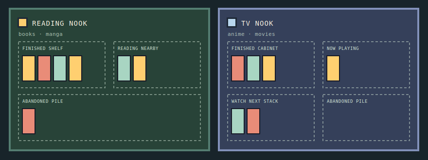

<div align="center">


# Katalos

**Your media taste, made tangible and shareable — without sharing what you keep private.**

Curate the books, manga, anime and movies you love into a cozy two-nook room,<br>
then share it with one public link. Private entries never leave your side of the wall.

[](https://katalos-black.vercel.app)

<sub>Rooms live behind a magic link — sign in with your email to build one in about a minute.</sub>


</div>

---

## The room

Katalos replaces the card grid every media tracker gives you. Your entries live as objects in a room, and **where a thing sits is its status** — no badges to read, just a glance.

<div align="center">

</div>

| | Reading nook — books & manga | TV nook — anime & movies |
|---|---|---|
| **finished** | on the shelf | in the cabinet |
| **in progress** | reading nearby | now playing |
| **planned** | reading nearby | watch-next stack |
| **abandoned** | the floor pile | the floor pile |

## What it does

- 🔑 **Passwordless sign-in** — one email magic link, no password to forget or leak.
- 🚪 **A room of your own** — name it, claim a username, and it lives at `/u/<username>`.
- 📚 **Four media types** — books, manga, anime and movies, each with status, rating, synopsis and a private note.
- 🔒 **Public / private per entry** — private items are never shown, hinted at, or *counted* in your public room.
- ✨ **Taste Profile** — Gemini reads the public shelves and writes a short prose read on someone's taste.
- 🔗 **One link to share** — visitors need no account to walk through your room.

## How privacy actually works

The interesting problem here isn't the CRUD — it's making "private" mean private all the way down the stack.

- **Postgres row-level security** is the source of truth. Owners read their own rows; anonymous visitors can only ever reach rows marked public.
- **The public room query** selects public rows only, so private entries are absent from the page — not hidden with CSS, not filtered in the browser.
- **The Taste Profiler receives public entries only**, and only a bounded set of fields. Gemini is never shown a private note.
- **No secret ever reaches the browser.** The Cloud Run bearer token, Google credentials and any privileged Supabase key stay server-side.

## Architecture

```text
Browser  →  Vercel · Next.js  →  Supabase Auth + Postgres (RLS)
                             →  Cloud Run · Taste Profiler  →  Gemini via ADC
```

The Next.js server queries the room owner's public rows, sends only bounded public fields to Cloud Run, and authenticates that call with a server-only bearer token. Cloud Run uses its attached service account's Application Default Credentials for Gemini. The browser receives none of it.

## Quick start

Requirements: **Node.js 20+** and a Supabase project.

```powershell
npm install
Copy-Item .env.example .env.local
npm run dev
```

Set these server/runtime variables in `.env.local` and in Vercel:

```text
NEXT_PUBLIC_SUPABASE_URL=https://your-project.supabase.co
NEXT_PUBLIC_SUPABASE_ANON_KEY=your-anon-key
TASTE_PROFILER_URL=https://YOUR-CLOUD-RUN-URL
TASTE_PROFILER_SHARED_TOKEN=a-long-random-shared-secret
```

<details>
<summary><b>Supabase setup</b></summary>

<br>

1. Run `supabase/migrations/001_initial_schema.sql` in the Supabase SQL editor.
2. In **Authentication → URL Configuration**, add `http://localhost:3000/auth/callback` and `https://YOUR-VERCEL-DOMAIN/auth/callback` to the redirect URLs.
3. Enable Email authentication and configure your production email sender as needed.
4. Follow [supabase/README.md](supabase/README.md) to verify row-level security with both an owner session and an anonymous one.

The app redirects unauthenticated `/room` requests to sign-in, sends first-time owners to `/onboarding`, and serves public rooms at `/u/<username>`.

</details>

<details>
<summary><b>Deploying the Cloud Run Taste Profiler</b></summary>

<br>

Deploy the separate service in [`cloud-run-taste-profiler/`](cloud-run-taste-profiler). Build it with Cloud Build or a container registry, attach a service account that can call Vertex AI, and set `TASTE_PROFILER_SHARED_TOKEN` to the same secret Vercel uses.

```bash
gcloud run deploy katalos-taste-profiler \
  --source cloud-run-taste-profiler \
  --region us-central1 \
  --service-account KATALOS_PROFILER_SERVICE_ACCOUNT \
  --set-secrets TASTE_PROFILER_SHARED_TOKEN=katalos-profiler-token:latest \
  --set-env-vars GOOGLE_CLOUD_LOCATION=us-central1,GEMINI_MODEL=gemini-2.5-flash
```

Grant the attached service account the minimum Vertex AI role needed to generate content. The service validates its bearer token and request body, asks Gemini for JSON, validates the returned schema, and rejects a `firstPick` that isn't in the supplied entries.

</details>

## Verifying

```bash
npm run test     # vitest — placement rules, profiler schema, forms
npm run build
```

The privacy path is worth checking by hand, since it's the claim that matters most: sign in as a new user, create a profile, add one public and one private entry, then open `/u/<username>` in a private window. The private entry should be **entirely absent** — no placeholder, no count. Generate a Taste Profile, and confirm the card degrades gracefully if Cloud Run is unavailable.

## Project layout

```text
app/                      Next.js routes — /, /room, /u/[username], /onboarding, /api
components/               auth · media · room (MediaRoom, DetailDrawer, TasteProfilerCard)
lib/                      placement rules, Supabase clients, taste prompt + schema
supabase/migrations/      schema and row-level security policies
cloud-run-taste-profiler/ standalone Gemini service
```

## Roadmap

A full hi-fi pixel-art redesign is specified and waiting to be built: hand-placed CSS sprites, three time-of-day themes that follow the visitor's clock, catalog search against Open Library / Jikan / TMDB, and a working CRT in the TV nook. The current app ships the room model and the privacy guarantees; the pixel dressing comes next.

<div align="center">
<br>
<sub>Built with Next.js, Supabase and Gemini. Taste Profiles are generated from public entries only.</sub>
</div>
