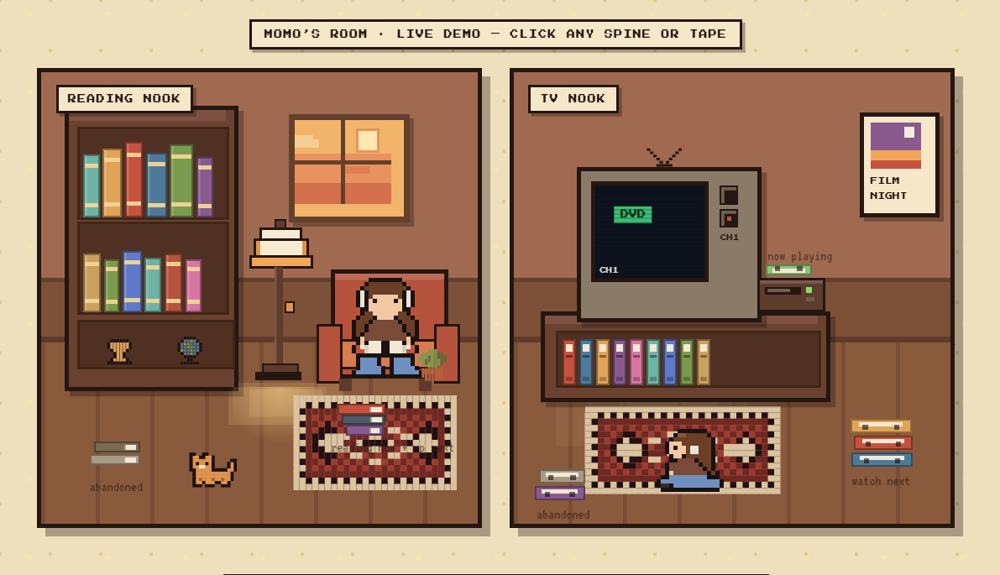

<div align="center">


# Katalos

**Your media taste, made tangible and shareable — without sharing what you keep private.**

Curate the books, manga, anime and movies you love into a cozy two-nook room,<br>
then share it with one public link. Private entries never leave your side of the wall.

<br>



<br><br>

[](https://katalos.tech)


</div>

---

## Hackathon submission snapshot

**Suggested category:** Consumer / social apps — Katalos turns personal media tracking into a visual, shareable room.

**Code repository:** [github.com/Samat-ai/katalos](https://github.com/Samat-ai/katalos)

**Short description:** Katalos is a privacy-first media taste room. People curate books, manga, anime, and movies as objects in two pixel-art nooks. Placement communicates status at a glance, private entries stay out of public queries and taste analysis, and a single room URL lets friends explore without an account. Passwordless magic-link sign-in, catalog search, interactive room objects, and an AI-generated Taste Profile make the room useful as both a tracker and a conversation starter.

**Judge-ready demo:** Open [katalos.tech](https://katalos.tech). The landing page and public-room experience are available without an account; the owner flow is available through the passwordless sign-in link. For a full authenticated review, provide a temporary test email/account in the hackathon submission form rather than committing credentials to this repository.

**Supported platforms:** Any current desktop or mobile browser for the web app; Node.js 20+ for local development; Vercel for the Next.js app; and Google Cloud Run for the optional Taste Profiler service.

**Video checklist:** Keep the public YouTube demo under three minutes. Show the landing room, a public room, the owner flow, one private/public media decision, and the Taste Profile. Narrate how Codex and GPT-5.6 were used to turn the handoff design into a tested, working product. Use original screen/audio capture or properly licensed assets only.

## How Codex contributed

Codex was used as an implementation partner throughout the project, not just as a code generator. GPT-5.6 helped inspect the existing codebase, turn the visual handoff into a reusable UI system, reconcile the design with the live Supabase/media flows, and debug route, responsive-layout, and interaction regressions. Codex also drove the test loop: it added focused Vitest coverage, ran the full suite and production build, and used browser smoke tests to check the landing CTA, sign-in route, mobile layout, and absence of horizontal overflow.

The key product decisions remained deliberate human choices: the room metaphor replaces a generic card grid; spatial placement communicates media status; privacy is enforced in database/public-query boundaries; and the visual language stays pixel-art, dark, and cyan-accented instead of accepting a hallucinated redesign. GPT-5.6/Codex accelerated exploration, implementation, and verification while the final interaction model and scope were reviewed against the handoff.

At runtime, the Taste Profiler uses Gemini 2.5 Flash through the Cloud Run service. GPT-5.6 and Codex contributed to building and validating the application; they are not presented as the runtime model behind the Taste Profile.

## The room

Katalos replaces the card grid every media tracker gives you. Your entries live as objects in a room, and **where a thing sits is its status** — no badges to read, just a glance.

| | Reading nook — books & manga | TV nook — anime & movies |
|---|---|---|
| **finished** | on the shelf | in the cabinet |
| **in progress** | reading nearby | now playing |
| **planned** | reading nearby | watch-next stack |
| **abandoned** | the floor pile | the floor pile |

## What it does

- 🔑 **Passwordless sign-in** — one email magic link, no password to forget or leak.
- 🚪 **A room of your own** — name it, claim a username, and it lives at `/u/<username>`.
- 📚 **Four media types** — books, manga, anime and movies, each with status, rating, synopsis and a private note.
- 🔒 **Public / private per entry** — private items are never shown, hinted at, or *counted* in your public room.
- ✨ **Taste Profile** — Gemini reads the public shelves and writes a short prose read on someone's taste.
- 🔗 **One link to share** — visitors need no account to walk through your room.

## How privacy actually works

The interesting problem here isn't the CRUD — it's making "private" mean private all the way down the stack.

- **Postgres row-level security** is the source of truth. Owners read their own rows; anonymous visitors can only ever reach rows marked public.
- **The public room query** selects public rows only, so private entries are absent from the page — not hidden with CSS, not filtered in the browser.
- **The Taste Profiler receives public entries only**, and only a bounded set of fields. Gemini is never shown a private note.
- **No secret ever reaches the browser.** The Cloud Run bearer token, Google credentials and any privileged Supabase key stay server-side.

## Architecture

```text
Browser  →  Vercel · Next.js  →  Supabase Auth + Postgres (RLS)
                             →  Cloud Run · Taste Profiler  →  Gemini via ADC
```

The Next.js server queries the room owner's public rows, sends only bounded public fields to Cloud Run, and authenticates that call with a server-only bearer token. Cloud Run uses its attached service account's Application Default Credentials for Gemini. The browser receives none of it.

## Quick start

Requirements: **Node.js 20+** and a Supabase project.

```powershell
npm install
Copy-Item .env.example .env.local
npm run dev
```

Set these server/runtime variables in `.env.local` and in Vercel:

```text
NEXT_PUBLIC_SUPABASE_URL=https://your-project.supabase.co
NEXT_PUBLIC_SUPABASE_ANON_KEY=your-anon-key
TASTE_PROFILER_URL=https://YOUR-CLOUD-RUN-URL
TASTE_PROFILER_SHARED_TOKEN=a-long-random-shared-secret
TMDB_READ_ACCESS_TOKEN=your-tmdb-read-access-token
OPEN_LIBRARY_CONTACT_EMAIL=you@example.com
```

<details>
<summary><b>Supabase setup</b></summary>

<br>

1. Run `supabase/migrations/001_initial_schema.sql` through `004_harden_catalog_rpcs.sql` in the Supabase SQL editor, in order.
2. In **Authentication → URL Configuration**, add `http://localhost:3000/auth/callback` and `https://YOUR-VERCEL-DOMAIN/auth/callback` to the redirect URLs.
3. Enable Email authentication and configure your production email sender as needed.
4. Follow [supabase/README.md](supabase/README.md) to verify row-level security with both an owner session and an anonymous one.

The app redirects unauthenticated `/room` requests to sign-in, sends first-time owners to `/onboarding`, and serves public rooms at `/u/<username>`.

</details>

<details>
<summary><b>Deploying the Cloud Run Taste Profiler</b></summary>

<br>

Deploy the separate service in [`cloud-run-taste-profiler/`](cloud-run-taste-profiler). Build it with Cloud Build or a container registry, attach a service account that can call Vertex AI, and set `TASTE_PROFILER_SHARED_TOKEN` to the same secret Vercel uses.

```bash
gcloud run deploy katalos-taste-profiler \
  --source cloud-run-taste-profiler \
  --region us-central1 \
  --service-account KATALOS_PROFILER_SERVICE_ACCOUNT \
  --set-secrets TASTE_PROFILER_SHARED_TOKEN=katalos-profiler-token:latest \
  --set-env-vars GOOGLE_CLOUD_LOCATION=us-central1,GEMINI_MODEL=gemini-2.5-flash
```

Grant the attached service account the minimum Vertex AI role needed to generate content. The service validates its bearer token and request body, asks Gemini for JSON, validates the returned schema, and rejects a `firstPick` that isn't in the supplied entries.

</details>

## Verifying

```bash
npm run test     # vitest — placement rules, profiler schema, forms
npm run build
```

The privacy path is worth checking by hand, since it's the claim that matters most: sign in as a new user, create a profile and avatar, add one public and one private entry, then open `/u/<username>` in a private window. The private entry should be **entirely absent** — no placeholder, no count. Copy the room link, generate a Taste Profile, and confirm the card degrades gracefully if Cloud Run is unavailable.

## Catalog credits and delivery

Catalog search is available to signed-in owners: Open Library powers books, Jikan powers manga and anime, and TMDB powers movies. Add the TMDB token and Open Library contact address only to Vercel/server environments. See [/credits](/credits) for provider attribution and disclaimers.

GitHub Actions runs tests, a production build, and a Cloud Run container build on pull requests and `master`. Connect the repository to Vercel for preview deployments and production deployment from `master`.

## Project layout

```text
app/                      Next.js routes — /, /room, /u/[username], /onboarding, /api
components/               auth · media · room (MediaRoom, DetailDrawer, TasteProfilerCard)
lib/                      placement rules, Supabase clients, taste prompt + schema
supabase/migrations/      schema and row-level security policies
cloud-run-taste-profiler/ standalone Gemini service
```

## Room details

The pixel room is hand-placed CSS with no bundled art assets, three time-of-day themes, catalog search through Open Library, Jikan and TMDB, and caching with per-user quota. The CRT includes channel switching and playable Pong on CH2; the cat, plant, lamp, and antenna are interactive.

<div align="center">
<br>
<sub>Built with Next.js, Supabase and Gemini. Taste Profiles are generated from public entries only.</sub>
</div>
